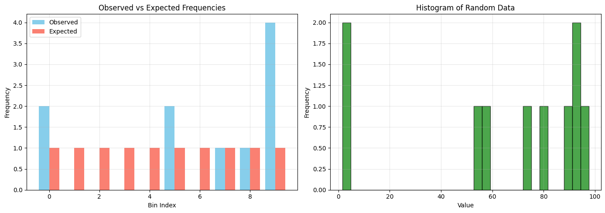
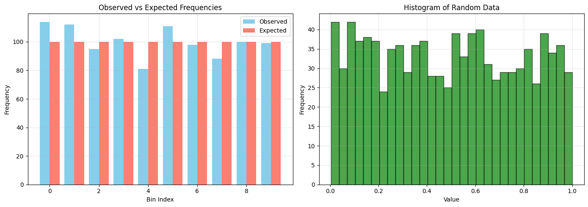
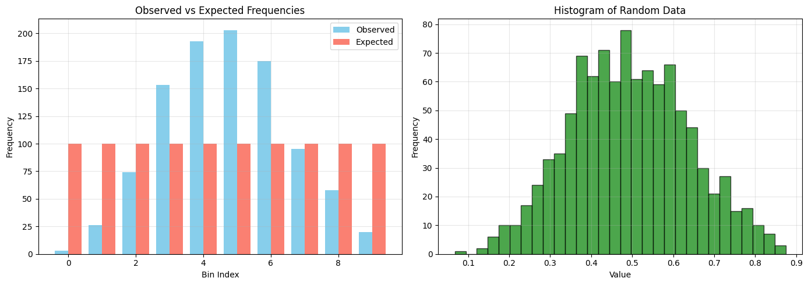
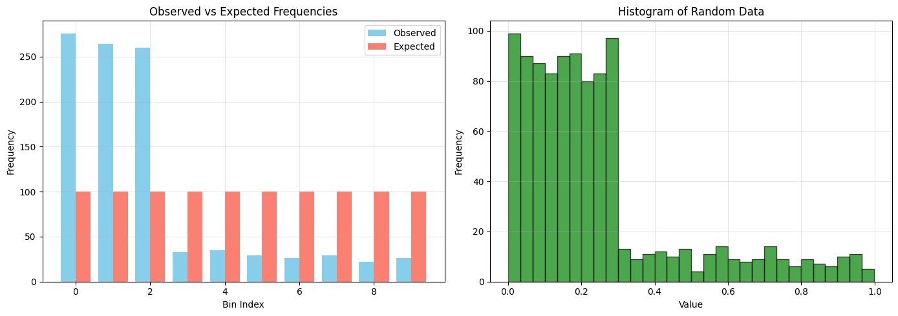

# How the Chi-Square Test Works
The chi-square test for uniformity checks if your random numbers are evenly distributed across different ranges (bins). 

1. Divide the data into bins (default 10)
2. Count observed frequencies in each bin
3. Calculate expected frequencies (total numbers ÷ number of bins)
4. Compute chi-square statistic: Σ[(observed - expected)² / expected]
5. Compare with critical value to determine pass/fail

## Why Tests Pass or Fail
The test PASSES (Indicates good randomness) when:
- Chi-square statistic < Critical value
- p-value > significance level (α = 0.05)
- Numbers are evenly distributed across bins

The test FAILS (Indicates poor randomness) when:
- Chi-square statistic > Critical value
- p-value ≤ significance level (α = 0.05)
- Numbers cluster in certain ranges

## Common Failure Scenarios
- Clustering: Numbers bunch together in certain ranges
- Bias: Some values appear much more frequently
- Patterns: Systematic relationships between numbers
- Poor RNG: Inadequate random number generator
- Deliberate non-randomness: Data isn't actually random

## Key Features of the Code

Multiple test examples showing good, biased, and poor random numbers Visual interpretation with histograms comparing observed vs expected frequencies Detailed explanations of why each test passes or fails Flexible parameters (bins, significance level) Statistical interpretation with p-values and critical values

The code will show when and why random numbers fail the uniformity test, helping you identify issues with random number generation or data quality.


```
Custom Test: 10 Random Numbers from Uniform(1,100)
Chi-square statistic: 16.0000
Critical value: 16.9190
p-value: 0.0669
Degrees of freedom: 9

Result: PASSES - Data appears uniformly distributed
Reason: Chi-square = 16.0000 < Critical value = 16.9190
Statistical meaning: p-value = 0.0669 > α = 0.05, fail to reject H₀

Observed frequencies: [2 0 0 0 0 2 0 1 1 4]
Expected frequency per bin: 1.00
```

```

CHI-SQUARE TEST FOR UNIFORMITY
========================================

Example 1: Uniform Distribution (should PASS)
Chi-square statistic: 10.0000
Critical value: 16.9190
p-value: 0.3505
Degrees of freedom: 9

Result: PASSES - Data appears uniformly distributed
Reason: Chi-square = 10.0000 < Critical value = 16.9190
Statistical meaning: p-value = 0.3505 > α = 0.05, fail to reject H₀

Observed frequencies: [114 112  95 102  81 111  98  88 100  99]
Expected frequency per bin: 100.00
```

```
Example 2: Biased Distribution (Beta(5,5), should FAIL)
Chi-square statistic: 514.4200
Critical value: 16.9190
p-value: 0.0000
Degrees of freedom: 9

Result: FAILS - Data is NOT uniformly distributed
Reason: Chi-square = 514.4200 > Critical value = 16.9190
Statistical meaning: p-value = 0.0000 ≤ α = 0.05, reject H₀

Observed frequencies: [  3  26  74 153 193 203 175  95  58  20]
Expected frequency per bin: 100.00
```

```
Example 3: Severely Non-uniform (80% in first 30%)
Chi-square statistic: 1193.0400
Critical value: 16.9190
p-value: 0.0000
Degrees of freedom: 9

Result: FAILS - Data is NOT uniformly distributed
Reason: Chi-square = 1193.0400 > Critical value = 16.9190
Statistical meaning: p-value = 0.0000 ≤ α = 0.05, reject H₀

Observed frequencies: [276 264 260  33  35  29  26  29  22  26]
Expected frequency per bin: 100.00
```


