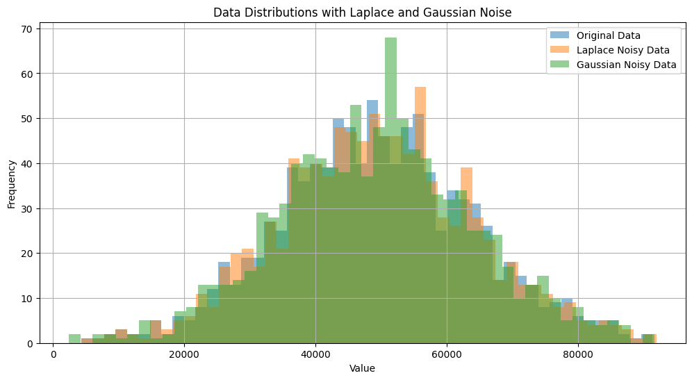
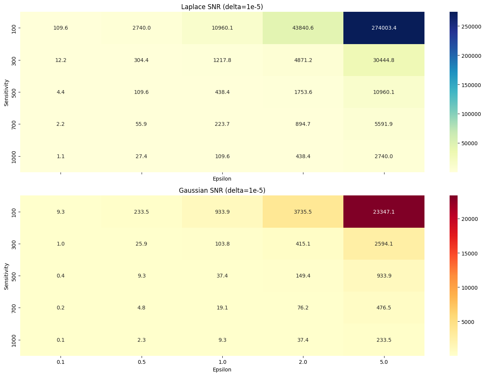
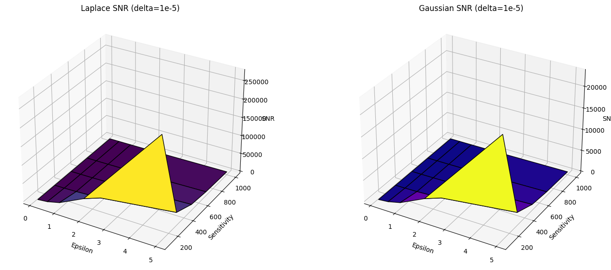
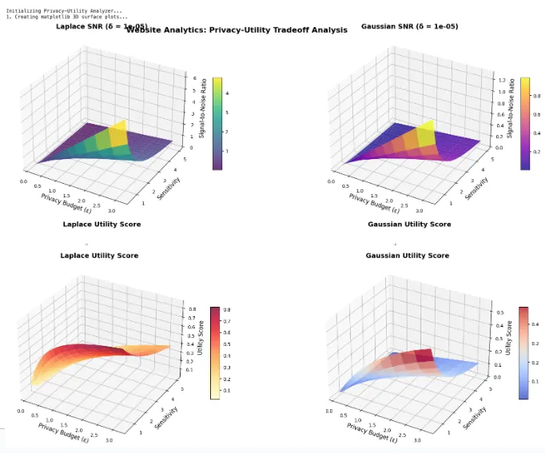
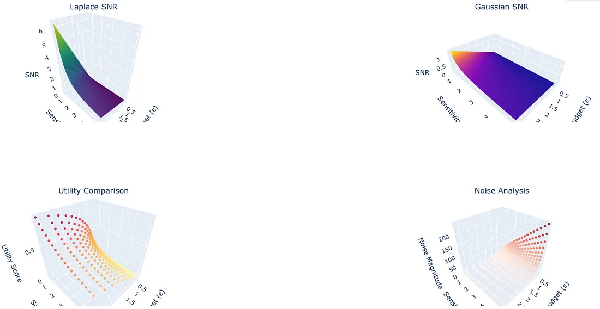
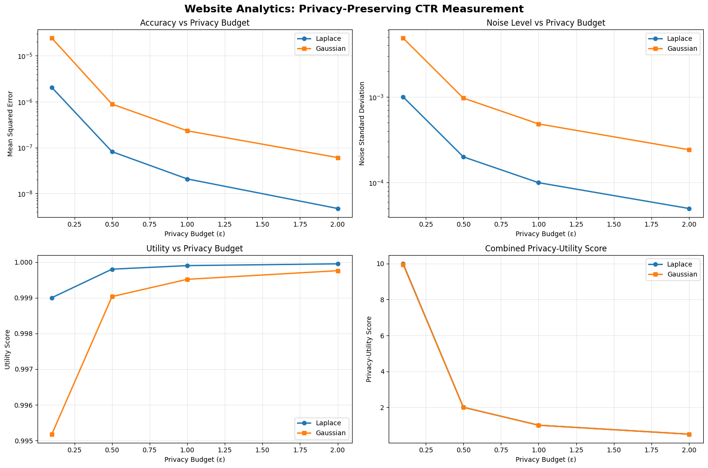

# Noise Determination For Data Privacy

To choose between Gaussian and Laplacian noise and determine if the Signal-to-Noise Ratio (SNR) is good enough for data privacy, you need to understand the goals of your privacy model, the expected sensitivity of the data, and the requirements of your application (e.g., analytics, ML, publication). 

## 🔐 1. Choosing Between Gaussian and Laplacian Noise

| Criteria                    | **Gaussian Noise**                                       | **Laplacian Noise**                         |
| --------------------------- | -------------------------------------------------------- | ------------------------------------------- |
| **Privacy Model**           | (ε, δ)-**Differential Privacy**                          | ε-**Differential Privacy**                  |
| **Use Case**                | When δ (small probability of failure) is acceptable      | When strict ε-DP is required                |
| **Distribution Shape**      | Bell curve, smoother tail                                | Sharp peak, heavier tail                    |
| **Sensitivity Handling**    | Works well for **group privacy**, advanced composition   | Better for single query, simple composition |
| **Mathematical Simplicity** | Requires **more complex analysis**                       | Simple closed-form mechanism                |
| **Common Applications**     | Machine learning, federated learning, correlated queries | Queryable databases, one-shot stats release |

> Rule of Thumb:
> Use Laplacian for simpler, strict privacy settings (like static query releases).
> Use Gaussian for more complex, composed or iterative systems (e.g., training ML models).

## 📏 2. How to Choose the Privacy Parameters (ε, δ) or Sensitivity
🔹 Sensitivity (Δf)
This is the maximum change in the output if a single individual's data changes.

- For Laplace noise:
Noise ~ Lap(Δf / ε)

- For Gaussian noise:
Noise ~ N(0, σ²), where
σ ≥ √(2 * log(1.25/δ)) * Δf / ε

> Δf depends on the query.

> Count queries: Δf = 1

> Sum queries: Δf = max possible value

> Mean: Δf = (max - min) / n

## 🎯 3. Evaluating Signal-to-Noise Ratio (SNR) for Privacy
SNR Formula:
$$\ \frac{Var(signal)}{Var(noise)} \$$

> High SNR → Useful data, but weaker privacy.
> Low SNR → Better privacy, but less utility.

| SNR Range | Interpretation                                      |
| --------- | --------------------------------------------------- |
| **> 10**  | High utility, but may **leak privacy**              |
| **1–10**  | **Balanced trade-off**: decent privacy, usable data |
| **< 1**   | Strong privacy, **poor utility**                    |

> In privacy-first systems, aim for SNR < 1 to 3, depending on risk tolerance.

## ⚖️ 4. Practical Selection Strategy

1. Determine the privacy budget (ε, δ):
- Small ε (e.g., 0.1–1): Strong privacy
- Larger ε (e.g., 2–5): Weaker, but more utility
- δ ≪ 1/n for Gaussian noise, where n = dataset size

2. Calculate the sensitivity (Δf) of your function.

3. Choose noise mechanism:
- Use Laplace if δ = 0 (strict DP).
- Use Gaussian if you're doing multiple queries/compositions or using tools like PATE/Federated Learning.

4. Simulate or analyze SNR:
- Generate sample outputs with and without noise.
- Measure how distinguishable the outputs are.

🧪 Example
Suppose you release the average income of a dataset:
- Max income = $500k, Min = $0, n = 1000
- Sensitivity = (500,000 - 0) / 1000 = 500
- ε = 1 (reasonable privacy)

- Laplacian Noise:
	- Scale = 500 / 1 = 500
	- Var(noise) = 2 × (500)² = 500,000

Assume signal variance = 1,000,000
→ SNR = 1,000,000 / 500,000 = 2 → Acceptable

✅ Run privacy-utility simulations before deployment.

✅ If using ML, consider privacy accounting tools like:
- TensorFlow Privacy
- Opacus (PyTorch)

✅ Use Rényi Differential Privacy (RDP) if doing repeated queries to track ε budget better.

## 📊 Signal & Noise Variance
Example: 
- Signal variance (original data): ~219 million
- Laplace noise variance: ~529 thousand
- Gaussian noise variance: ~5.4 million

## 🔉 Signal-to-Noise Ratios (SNR)
- SNR (Laplace noise): ~414 → Very high utility, low privacy risk
- SNR (Gaussian noise): ~40.6 → Still good utility, but better privacy

## 🎯 Interpretation
- An SNR > 10 generally implies the signal is still easily distinguishable from the noise.
- If aiming for stronger privacy, and for SNR values below 10, preferably 1–3 depending on the threat model.
- The current noise levels are quite mild for both mechanisms, suggesting you could:
	- Increase noise (reduce ε or increase δ for Gaussian),
	- Or check if this level of privacy is adequate for the needs.

## Tuneable ε, δ, or sensitivity to see how the SNR and distributions change

### 🔵 Laplace SNR (ε vs Sensitivity)
- Higher ε (weaker privacy) → Higher SNR (better utility).
- Lower sensitivity → also improves SNR significantly.
- For example, at ε = 5 and sensitivity = 100, SNR > 2000 → near-original utility.

### 🔴 Gaussian SNR (ε vs Sensitivity, fixed δ = 1e-5)
- SNR is generally lower than Laplace for the same ε and sensitivity — indicating stronger privacy.
- Still, increasing ε or reducing sensitivity improves SNR.
- For ε = 5 and sensitivity = 100, SNR is ~180 — strong utility, moderate privacy.

### 📌 Summary of Tuning Effects:
| Parameter       | Increase | Effect                       |
| --------------- | -------- | ---------------------------- |
| **ε (epsilon)** | ↑        | ↓ Privacy, ↑ SNR (↑ utility) |
| **δ (delta)**   | ↑        | ↓ Privacy for Gaussian only  |
| **Sensitivity** | ↑        | ↓ SNR (↑ noise), ↑ privacy   |

# Interactive-style 3D surface plots
🔷 Left: Laplace SNR Surface
High epsilon (towards the front right) leads to very high SNR, meaning weaker privacy.

High sensitivity (toward the back) reduces SNR — more noise for the same ε.

🔶 Right: Gaussian SNR Surface
More curved and sensitive to both ε and sensitivity.

Because of the δ component, Gaussian noise grows faster with sensitivity than Laplace.

✅ Takeaways
Laplace is more sensitive to ε and less to δ (which it doesn’t even use).

Gaussian requires careful δ tuning and is more useful when you need composability or approximate DP.

Use these plots to decide the optimal ε/sensitivity pair to balance privacy budget and data utility.

