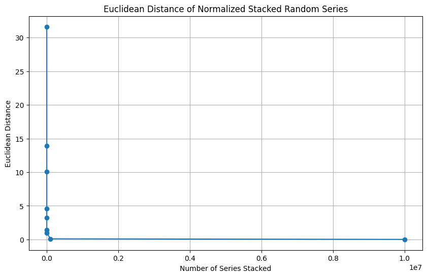
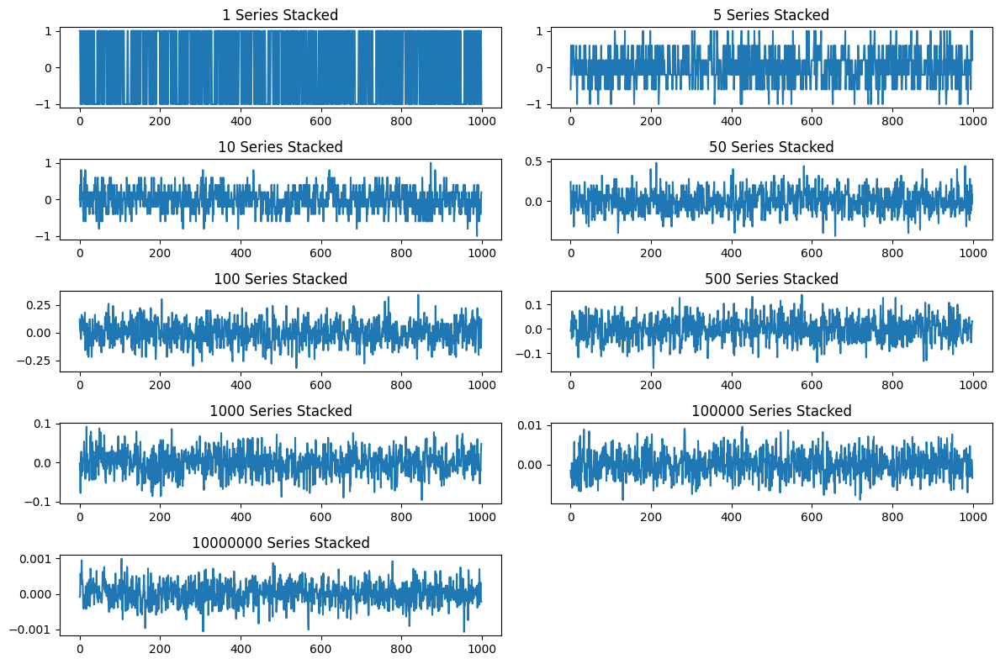

# Random Series Stacking for Noise Cancellation

This project demonstrates the concept of noise cancellation through stacking random series generated by coin flips (values of 1 or -1). The main goal is to visualize how the noise cancels out as more series are added. The process follows the Law of Large Numbers, where the cumulative effect of random variables tends to average out to zero as the number of variables increases.

## Overview

1. Generate random series consisting of values strictly from \([-1, 1]\), simulating coin flips.
2. Stack these series additively to create a cumulative series.
3. Normalize the cumulative series to observe how the noise diminishes.
4. Calculate and visualize the Euclidean distance of the normalized series as we stack more series.
5. Show how the noise approaches zero as the number of stacked series increases.

### Key Concepts

- **Euclidean Distance**: Measures the magnitude of the resulting series after stacking the random series. As we add more series, the Euclidean distance should decrease, indicating noise cancellation.
- **Noise Cancellation**: The phenomenon where random variations (noise) from multiple series add up but average out as more series are stacked.

## Files

- `random_series_stack.py`: Python script that implements the random series stacking and noise cancellation demonstration.
- `images/Euclidean_Distance_of_Normalized_Stacked_Random_Series.png`: Plot showing the Euclidean distance as a function of the number of stacked series.
- `images/N_series_stacked.png`: Plots showing the normalized series for different numbers of stacked series.

### Results
   - Euclidean distance decreases as more series are stacked.

   - Resulting series at different stages of stacking.

